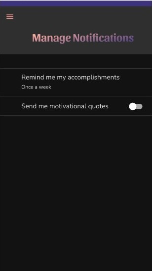

# <div align="center">🏆😊HackCamp 2020 : Winner Kabam -- Best UI/UX Design😊🏆</div>

# <div align="center">Hype</div>

<div align="center"></div>

<div align="center">Hype aims to eliminate Imposter Syndrome through tracking accomplishments and reinforcing one's ability through daily personalized notifications to remind one of what they've accomplished.</div>


### <div align="center">🚧 We are updating our product 🚧</div>

# Table of Content:
- [First look](#first-look)
- [UI Prototype](#ui-prototype)
- [Programming Language used ](#programming-language-used)
- [Prerequisites](#prerequisites)
- [Setting up the project](#setting-up-the-project)
- [Run the app](#run-the-app)
- [Members](#members-list)
- [Awards](#awards)
- [Devpost](#devpost)
# First look

<div align="center"></div>     

# UI Prototype 
#### By Simi : https://github.com/simidesigns
                  
# Programming language used

### Frontend: 
This project uses Flutter - a free and open-source mobile UI framework which uses a programming language called Dart.

### Backend:
This project uses Go lang - a statically typed, compiled programming language designed at Google.
- Please follow these steps at : 
https://golang.org/doc/install


## Prerequisites
1) [Install Flutter SDK](https://flutter.dev/docs/get-started/install) 
2) [Setup Editor](https://flutter.dev/docs/get-started/editor) 
3) [Setup Android Device](https://flutter.dev/docs/get-started/install/windows#set-up-your-android-device) or [Setup Android emulator](https://flutter.dev/docs/get-started/install/windows#set-up-the-android-emulator)


# Setting up the project 


## Setting up mongoDB
### Making atlas account
 1.Click Sign up with Google or email
 2.Click Next.
 3.Enter the password for your account.
 4.Click Next.
 5.Review and select the checkbox to accept the Terms of Service and the Privacy Policy.
 6.Click Submit.
### Deploy a free tier cluster
1. Log into Atlas
2. Click Build a Cluster.
3. Select Starter Clusters and click Create a Cluster.
4. Select your preferred Cloud Provider & Region.
5. Select M0 Sandbox for cluster tier
6. Enter a name for your cluster in the Cluster Name field.
7. Click Create Cluster to deploy the cluster
### Add Your Connection IP Address to IP Access List
1. Open the Connect dialog
2. Configure your IP access list entry.
3. Click Add IP Address
### Create a Database User for Your Cluster
1. Open the Connect dialog
2. In the Create a MongoDB User step of the dialog, enter a Username and a Password for your database user.
3. Click Create MongoDB User.
### Connect to Your Cluster
1. Open the Connect dialog
2. Click Connect Your Application.
3. Select Go from the Driver dropdown and select your version of the driver
4. In a text editor, update the copied connection string with your password
5. Connect to your cluster by copy pasting the mongo string in server/web/keys.go file.
`
var mongoString = "Insert your key here"
`
### In case any issues occur during setup 
- Please refer to the official mongoDB documentation 
https://docs.atlas.mongodb.com/getting-started


## Run the app
### Frontend : Flutter
1) Locate the main Android Studio toolbar:
2.  In the **target selector**, select an Android device for running the app. If none are listed as available, you can use an actual android device or select **Tools> Android > AVD Manager** and create one there. For details, see [Managing AVDs](https://developer.android.com/studio/run/managing-avds).
3. Please get and upgrade packages by typing these commands 
    - From the terminal: Run flutter pub get . OR.
    - From Android Studio/IntelliJ: Click Packages get in the action ribbon at the top of pubspec. yaml .
    - From VS Code: Click Get Packages located in right side of the action ribbon at the top of pubspec. yaml .
    
4.   Click the run icon in the toolbar, or invoke the menu item **Run > Run**.


### Backend : GOlang
1. Open the folder in vs code or your favorite editor
2. Run the following command 
`
go run ./web
`

### **Note : Please keep the server on while you are using the application so that the requests can go through 

# Members List:
 ```
 Simi : https://github.com/simidesigns
 ```
 ```
 Kenny : https://github.com/kennyjhcheng
 ```
 ```
 Ash : https://github.com/AshCatchEmAll
 ```
 
# Awards:

<div align="center"></div>

## Devpost:
https://devpost.com/software/hype-nzhf46
